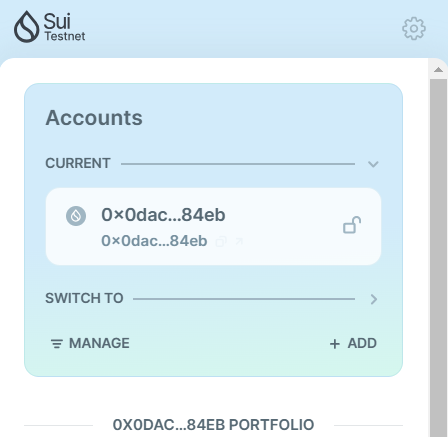

## Basic Information
- Sui Wallet Address: `0x0dacf25e0be00045a2973bd9b5db6cb9781074239699c122857724c50fc284eb`
- Github: `duch25`

## Personal Introduction
- Work Experience: `< 1 year`
- Tech Stack: `Solidity` `Rust` `TypeScript` `Nest.js` `React.js/Next.js`
- I am a motivated and passionate blockchain developer with under a year of experience, transitioning from web2 development into the blockchain space. My journey started with web2 technologies, and I quickly moved to web3, with Ethereum as my first platform. I am particularly interested in exploring the technical depth of blockchain and security-related challenges, with a strong focus on performance optimization. I focus on writing secure, efficient, and scalable smart contracts and decentralized applications (dApps). Additionally, I have a keen interest in understanding the business implications of blockchain technology and how it can drive innovation in various industries. 
- Contact: 
    - Telegram: [`duch_25`](https://t.me/duch_25)
    - Linkedin: [`duch25`](https://www.linkedin.com/in/duch25/)

## Tasks

### 01 hello move
- [x] Sui CLI Version: sui 1.38.3 
- [x] Sui Wallet Screenshot: 
- [x] Package ID: `0xe84233bbe82a5bd3f4053362c2cf60aa6f01801c5b1595f8f551a4eb0d6911df`
- [x] Package ID's Screenshot from Explorer: 

### 02 move coin
- [ ] `My Coin` Package ID:
- [ ] `Faucet Coin` Package ID:
- [ ] Transfer `My Coin` hash:
- [ ] `Faucet Coin` address 1 mint hash:
- [ ] `Faucet Coin` address 2 mint hash:

### 03 move nft
- [ ] NFT Package ID:
- [ ] NFT Object ID:
- [ ] Transfer NFT hash:
- [ ] NFT's Screenshot from Explorer: Link to image uploaded to `images` folder.

### 04 move game
- [ ] Game Package ID:
- [ ] Deposit Coin Hash:
- [ ] Withdraw Coin Hash:
- [ ] Play Game Hash:

### 05 move swap
- [ ] Swap Package ID:
- [ ] Call Swap Coin A -> Coin B hash:
- [ ] Call Swap Coin B -> Coin A hash:

### 06 dapp-kit SDK PTB
- [ ] Save Hash:
